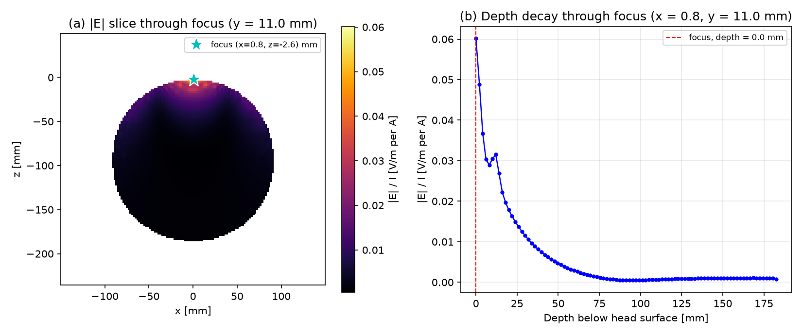

# Research Agent

[](https://github.com/y-xiAohAo/TMSresearch-agent/actions/workflows/ci.yml)


科研智能体：ReAct 循环编排 18 个工具（文献检索 / 论文参数抽取 / Sim4Life 建模与有损求解 / TMS 线圈优化 / wiki 记忆），打通"论文 → 仿真参数 → 头模建模 → 有损求解 → 定量场验证"的科研自动化闭环，并把研究结论沉淀为个人 wiki 知识库。


> Demo：agent 自主完成"检索论文 → 子代理抽取仿真参数 → 写入 wiki"的文献链路（真实运行录制，`scripts/record_demo.py` 可复现）。

- 测试：236 collected / 227 非冒烟全绿（CI 在线可验证；冒烟口径 = 5 个冒烟/e2e 文件 + 契约内嵌冒烟类，需真实 Sim4Life 环境，本地/CI 自动忽略）
- 定量验证：基准复算 E 场三分量 max 相对差 0.000%（~79 万体素/分量）；网格收敛 4.60%；头模有损求解 6 迭代收敛

## 定量场验证（B4 头模有损求解）



figure8 线圈 + 三层球壳头模（脑/颅骨/头皮，ITIS 组织电导率）的 MQS 求解结果：场峰位于头表线圈正下方，向脑内单调衰减；~20mm 深度处 E/I ≈ 1.9e-2 V/m/A（5kA 等效 ≈96 V/m，正处 TMS 刺激阈值量级）。可复现：`python scripts/plot_b4_field_profile.py`（h5py 直读 Output.h5）。

## 架构

```
User question
    │
    ▼
┌────────────────────────────────────────────┐
│  ReAct Loop (litmusAgent engine + DeepSeek) │
│  Recall → Ground → Plan → Act → Observe     │
│  → Reflect → Distill                        │
└──┬───────┬────────┬────────┬────────┬──────┘
   │       │        │        │        │
 web_search sim4life s4l_*   tms_    wiki_*
 (Tavily)  _manual_qa (建模/求解 optimize (记忆)
           (RAG API) 编排/场提取) (NSGA2)
```

- **编排**：litmusAgent `Agent` 引擎（`../litmusAgent`，editable 安装），LLM 走 DeepSeek（OpenAI 兼容）。
- **工具**：`src/research_agent/tools/`，每个文件导出 `ToolDescriptor`（含 category/cost_hint/requires 元数据），在 `register_all_tools()` 中显式注册（M2 规划目录自动发现）。
- **扩展性**：`ToolDescriptor.requires` 启动自检；M2 将加入目录自动发现、执行钩子链（experiment tracking）与异步任务抽象（见 `mydocs/specs/2026-07-21_m1-research-agent.md` §4.4）。

## 工具清单

| 工具 | 类别 | 说明 |
|---|---|---|
| `web_search` | literature | Tavily 联网检索（泛网页/资讯） |
| `arxiv_search` | literature | arXiv 精确文献检索（分类/日期/作者） |
| `arxiv_fetch` | literature | arXiv 元数据获取 + PDF 归档 |
| `arxiv_read_pdf` | literature | arXiv PDF 按页阅读（pymupdf） |
| `lit_extract_params` | literature | 论文→仿真参数桥（LLM 抽取+引句） |
| `paper_analyze` | literature | 论文理解子代理（agent-as-tool，语义导航+结构化抽取） |
| `sim4life_manual_qa` | knowledge | Sim4Life 手册 RAG（需先启动 RAG 服务） |
| `s4l_write_script` | simulation | 写 s4l_v1 脚本（自动加 headless 引导头） |
| `s4l_run_script` | simulation | headless 执行 Sim4Life 建模/仿真脚本（无求解 license） |
| `s4l_model` | simulation | TMS 线圈建模闭环：编译模板→headless 执行→实体断言验证（figure8/单环）；可选 MQS 仿真设置/三层球壳头模，默认预检模式（不占求解 license） |
| `s4l_solve_run` | simulation | 头模有损求解一键编排：编译→headless 预检 fail-fast→GUI --run 求解→场提取→两级验证（定量锚/特征判据），分 stage 报告 |
| `s4l_solve_benchmark` | simulation | 基准复算验证：GUI --run 重跑（继承 license）→h5py 逐体素对比→判定（严格串行） |
| `s4l_field_extract` | verify | 从 Output.h5 提取焦点场指标（峰值/E-I 比/深度/单峰性/单调衰减）+ 特征级判定（纯 h5py，零 license） |
| `reproduce_s4l` | simulation | 论文→抽参→求解→复现报告端到端编排（缺必需字段报错要求重试或显式 assumptions，不静默填充） |
| `tms_optimize` | compute | TMS 流函数线圈优化（NSGA2 小参数模板） |
| `reproduce_tms` | compute | 论文→优化端到端复现编排（synthesis 底盘 + 对比报告） |
| `wiki_write` / `wiki_search` | knowledge | 个人 wiki 记忆读写（向量+关键词混合语义检索，chroma 本地索引） |

## 快速开始

```powershell
# 1. 安装（Python 3.12）
python -m venv .venv
.\.venv\Scripts\Activate.ps1
pip install -e ".[dev]"
pip install -e ../litmusAgent

# 2. 配置 .env（复制 .env.example，填入 DeepSeek / Tavily key 与路径）

# 3. 启动 RAG 服务（另一个终端）
cd ..\Sim4Life-RAG-Helper
python -m uvicorn api_fastapi:app --host 127.0.0.1 --port 8000

# 4. 测试
python -m pytest tests/

# 5. 端到端 demo
python scripts/demo_research.py
```

## 环境变量

见 `.env.example`：`DEEPSEEK_API_KEY`、`TAVILY_API_KEY`、`RAG_BASE_URL`、`S4L_HOME`、`S4L_PYTHON`、`S4L_GUI`（求解用 GUI --run 执行器，缺省从 S4L_HOME 推导）、`TMS_PROJECT_DIR`、`TMS_PYTHON`。

## 兄弟项目（只读调用，不改动）

- `../Sim4Life-RAG-Helper`：Sim4Life 手册 RAG 服务
- `../StreamFunctionTMS`：TMS 流函数优化器
- `../litmusAgent`：Agent 引擎
