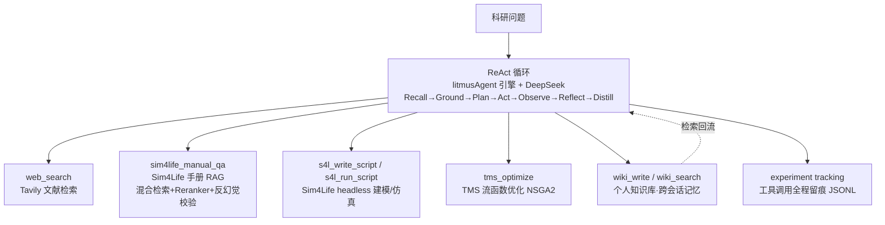

# Research Agent — 项目总览（简历素材）

## 一句话定位

科研智能体：以自研 Agent 框架为引擎，通过 ReAct 循环驱动 Sim4Life 手册 RAG 知识库、Sim4Life headless 仿真建模、TMS 流函数线圈优化与联网检索，并把研究结论自动沉淀为可跨会话检索的个人 wiki 知识库。

## 架构图

## 四仓库关系

| 仓库 | 角色 | 独立测试 |
|---|---|---|
| `TMSresearch-agent`（本项目） | 编排层：ReAct 循环 + 6 工具 + 记忆 + 追踪 | 17 |
| `Sim4Life-RAG-Helper` | 知识库：手册 RAG 服务（被调用） | 37 |
| `StreamFunctionTMS` | 计算工具：流函数优化器（被调用） | 405 |
| `litmusAgent` | Agent 引擎（被复用） | 678 |

## 量化指标（2026-07-22 实测）

| 指标 | 数值 | 来源 |
|---|---|---|
| 工具调用成功率 | 30/30 = 100% | experiment_log.jsonl |
| 端到端 demo | EXIT=0，产出 wiki + .smash | demo_research.py |
| 跨会话记忆召回 | 新会话召回 5 条历史记录 | A4 验证 |
| 鲁棒性用例 | 6/6（宕机/超时/脚本错误均有明确报错） | test_robustness.py |
| Sim4Life headless 建模 | 15.3s 平均，3/3 成功 | 冒烟+实跑 |
| TMS 优化（小参数） | 1.8s 平均，4/4 成功 | 契约+实跑 |

## B 阶段量化指标（2026-08 实测，Phase B1–B4）

| 指标 | 数值 | 来源 |
|---|---|---|
| 论文→参数→仿真闭环 | 2511.00744 figure8 端到端复现 | B1 spec |
| 基准复算精度 | E 场 max 相对差 0.000%（79 万体素/分量） | B3 S4lSolveSmoke |
| 头模有损求解 | MQS 6 迭代收敛，GUI --run 全程 420s | B4 求解日志 |
| 网格收敛性 | 1mm vs 2mm 焦点 E 差 4.60%（<5%） | B4 复算对比 |
| 焦点场量级 | E/I=1.93e-2 V/m/A，5kA 等效 ≈96 V/m（刺激阈值量级） | B4 场提取 |
| 测试规模 | 回归基线 157+1 绿（全量 447s） | pytest |
| 实测排查 | license/API/体素化 70+ 轮，踩坑清单 40 条 | spec/skill |

## 技术关键词

Agentic RAG · Function Calling · ReAct · Tool Orchestration · ToolDescriptor 元数据 · Headless Automation · Experiment Tracking · Knowledge Memory / Wiki · Hybrid Retrieval · Reranker · SSE · Prompt Engineering
